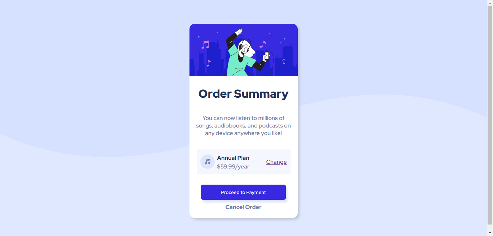

# Frontend Mentor - Order summary card solution

This is a solution to the [Order summary card challenge on Frontend Mentor](https://www.frontendmentor.io/challenges/order-summary-component-QlPmajDUj). Frontend Mentor challenges help you improve your coding skills by building realistic projects. 

## Table of contents

- [Overview](#overview)
  - [The challenge](#the-challenge)
  - [Screenshot](#screenshot)
  - [Links](#links)
  - [Built with](#built-with)
  - [Continued development](#continued-development)
- [Author](#author)

## Overview

A solution to the [Order summary card challenge on Frontend Mentor](https://www.frontendmentor.io/challenges/order-summary-component-QlPmajDUj).

### The challenge

Users should be able to:

- See hover states for interactive elements

### Screenshot

### Links

- Solution URL: [Solution URL](https://your-solution-url.com)
- Live Site URL: [Live site URL](https://your-live-site-url.com)

### Built with

- Semantic HTML5 markup
- CSS custom properties
- Flexbox
- Media Queries
- Mobile-first workflow

### Continued development

I'm going to keep improving on Flexbox and Media queries

## Author

- Frontend Mentor - [@Mustapha62996](https://www.frontendmentor.io/profile/Mustapha62996)
- Twitter - [@hassmustapha](https://www.twitter.com/hassmustapha)
